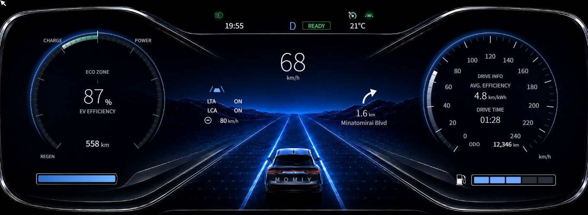

# agl-slint-cluster

A digital instrument cluster written in [Rust](https://www.rust-lang.org/) and
[Slint](https://slint.dev/), built for
[Automotive Grade Linux](https://www.automotivelinux.org/). It renders straight
to KMS/DRM with the Skia renderer — no compositor — and runs on a range of AGL
boards. It was developed and verified on a FriendlyELEC NanoPC-T6 (Rockchip
RK3588, Mali-G610).



## Repository layout

The `.slint` UI is language-agnostic, so it is shared across targets while each
target keeps its own thin application layer:

```
ui/          shared, language-agnostic UI (.slint + assets) -- the design lives here
can/         the CAN frame layout as a DBC, shared by every target (see docs/can.md)
rust/        Linux / AGL application (this is what builds today)
zephyr/      C++ on Zephyr RTOS            (planned)
baremetal/   no_std Rust on an MCU, e.g. Pico 2 / RP2350 (planned)
```

Only the small application layer (the `Telemetry` source and the glue that
writes properties) is per-target; the gauges, telltales and layout are reused.

## Features

- Two round gauges: a centre-zero power / charge meter with an EV-efficiency
  read-out on the left, and a speedometer on the right, both drawn as true
  circles with a soft glow.
- Battery and fuel gauges, average efficiency, drive time, odometer, range, and
  ADAS read-outs (lane assist, cruise, next turn).
- A top **telltale band**: standard warning and status lamps (headlights,
  parking brake, ABS, engine/MIL, oil, battery, seatbelt, door, cruise, lane)
  plus turn signals. Lamps only appear when lit, in their ISO colour with a
  soft halo, so the display stays clean.
- Real wall-clock time, and all on-screen text is translatable (`@tr()`).

## How it is put together

The rendering and the data are kept strictly apart, which makes the display easy
to drive from anything:

- `rust/src/telemetry.rs` — a plain `Telemetry` struct in physical / semantic units
  (km/h, 0..1 levels, lamp states), and a `TelemetrySource` trait with a single
  `poll(dt) -> Telemetry`.
- `rust/src/sim.rs` — the built-in demo source: one repeating drive cycle from which
  every reading is derived, the way the real signals relate to each other.
- `rust/src/main.rs` — `apply()` is the *only* place that turns a `Telemetry` frame
  into widgets (string formatting, dial-angle mapping, the clock). `select_source()`
  picks the source at runtime.
- `ui/*.slint` — the UI. `app-window.slint` is the single compiled entry point.

### Feeding real or emulated data

Implement `TelemetrySource` for your bus (CAN / VSS / DDS), a replay file, or an
emulator, and return it from `select_source()` in `rust/src/main.rs`. Nothing in the
UI has to change — it only ever reads properties. The `CLUSTER_SOURCE` environment
variable selects the source at runtime; it currently accepts only `sim`
(the built-in simulation), which is also the default.

## Building

Install Rust (https://www.rust-lang.org/learn/get-started), then:

### Desktop (development)

```sh
cd rust
cargo run                       # a normal window (winit + FemtoVG)
```

For a headless preview (e.g. over VNC), the `qt` feature runs under the Qt
backend instead:

```sh
cargo build --no-default-features --features qt   # in rust/
```

### On an AGL board (KMS/DRM + Skia)

```sh
cargo build --release --no-default-features --features device   # in rust/
```

The `device` feature uses the linuxkms backend with the Skia renderer, taking
the display directly (DRM master). Cross-compilation and image integration are
done with Yocto/OpenEmbedded (a `meta-` layer with a BitBake recipe); this
repository is the application source only.

> On AGL, the seamless boot-splash handover (rendering on a lease from
> `drm-lease-manager` instead of taking DRM master) is added when packaging the
> image. It is a deployment concern and deliberately kept out of the app.

### From a CAN bus

Set `CLUSTER_SOURCE=can` (or `can:<iface>`) and the cluster reads its signals
from a SocketCAN interface instead of the built-in simulation. The frame layout
is small and documented in [`docs/can.md`](docs/can.md), with a DBC in `can/`
for tools like cantools or SavvyCAN. To play with it without hardware, put the
simulation on a virtual bus:

```sh
sudo ip link add dev vcan0 type vcan && sudo ip link set up vcan0
CLUSTER_SOURCE=can:vcan0 cargo run &     # in rust/
cargo run --bin cansim                   # sends the drive cycle on vcan0
cansend vcan0 104#15                     # ..and poke at it: indicator, low beam, parking brake
```

### Deployment

`agl-slint-cluster.service` is a systemd unit that starts the cluster on the board. It sets
the linuxkms backend and the DRM lease name, and orders itself after the
`drm-lease-manager` and boot-splash services. It ships without systemd
sandboxing (`ProtectSystem`, `NoNewPrivileges`, ...); add those for a
production image.

## Credits and license

The Rust and Slint source is original work under the **MIT** license (see
`LICENSE`). The bundled telltale icons come from the Automotive Grade Linux
cluster demo and remain under the **Apache License 2.0**
(`ui/assets/telltales/LICENSE`). See [`CREDITS.md`](CREDITS.md) for the full
attribution of all third-party assets.
